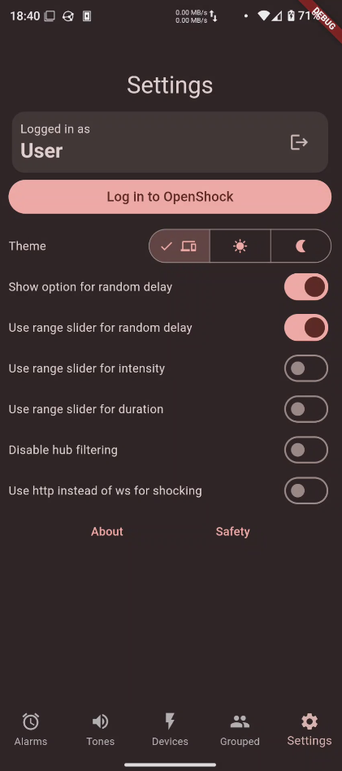

#  ShockAlarm
&nbsp;

A powerfull app for controling [OpenShock](https://openshock.org/) shockers and setting alarms with custom tones.

A web version (for IOS, Windows, ...) can be found [here](https://computerelite.github.io/ShockAlarmApp/).

# Features
ShockAlarm is a powerful tool for controlling your Shockers via OpenShock. It allows you to fully manage your shockers, logs, shares, hubs, and share links.

There is advanced functionaity like controling multiple shockers at the same time and specifying a random interval for intensity, duration and a delay (if you're into that).

It's fully material you themed just like the standard Android apps you're already used to and provides a responsive ui with a nice design.

Furthermore it fixes some layout flaws of the official OpenShock Frontend like having shared and own shockers in seperate tabs (which is annoying). On top it also has lots of info buttons you can press to get more insight on what something does.

# Installation on Android
## Through Obtainium (recommended as you get the updates the fastest)

1. Download [Obtainium](https://obtainium.imranr.dev/) either via [their website](https://obtainium.imranr.dev/) or [FDroid](https://f-droid.org/)
2. Add ShockAlarm by clicking [here](https://apps.obtainium.imranr.dev/redirect.html?r=obtainium://add/https://github.com/ComputerElite/ShockAlarmApp) or putting `github.com/ComputerElite/ShockAlarmApp` as th app source

## FDroid

1. [Download FDroid](https://f-droid.org/)
2. Search for ShockAlarm and install it. As easy as that!

## GitHub
Install the apk file from the [releases](https://github.com/ComputerElite/ShockAlarmApp/releases/latest)

# Installation on Linux
## Through the AUR
Use your favorite aur helper like [paru](https://github.com/Morganamilo/paru) or [yay](https://github.com/Jguer/yay) and install `shock-alarm`. [link to aur](https://aur.archlinux.org/packages/shock-alarm)

# Screenshots

[More images](fastlane/metadata/android/en-US/images/phoneScreenshots)

# Planned features
- [x] (Un)Pausing of shockers
- [x] Login with username/email and password
- [x] Random delay
- [x] Renaming of shockers (global)
- [x] Viewing of logs
- [x] Change sharing limits
- [x] Create share codes
- [x] Redeem share codes (untested)
- [x] Adding of shockers
- [x] Creation, editing and pairing of hubs
- [x] Add option to repeat default shock/vibration... option for one minute (perhaps adjustable in settings). Needs reworking of the alarm stop feature
- [x] Websocket controlling
- [x] Alarm tones (ui implemented)
- [x] Grouping of shockers
- [x] Redo settings
- [x] Random intensity and duration
- [x] Safety warning
- [x] Share link management
- [x] Allow setting initial limits when adding a shocker
- [x] Add ui to rename tones
- [x] Better desktop support (keybinds)
- [x] Better desktop support (layout)
- [ ] Better desktop support (dynamic layout)
- [x] Show 3 point menu when 1 shocker is selected
- [ ] Share codes sometimes can't be claimed when the app is already open
- [x] Show loading animation when share codes are loading in after shares loaded
- [x] Allow toggling of the captive portal
- [x] Add alarm renaming
- [x] Finally code weekday scheduling for alarms
- [x] Add changing of shocker type (and even hub and rfId)
- [x] save last opened tab (and load it on start)
- [x] Random shocking (specify random delay between shocks, min and max intensity/duration)
- [x] Random shocking -> Add background task + notification (works without notification???)
- [x] Fix alarms not sending controls when app is minimized (seems to work)
- [ ] Live controls
- [x] Allow alarm tones to be used as patterns
- [x] Request permissions only when needed
- [x] fix reloading problems in settings after login?
- [ ] (Big controls mode)
- [x] Improved login for web (aka using token requests)
- [x] Web support (alarms not working)
- [x] Linux support (alarms not working)
- [x] Alarm support for linux and web via https://dev1.rui2015.me
- [ ] Add seperate slider for shock and vibrate intensity
- [x] Add Alarm tone support for AlarmServer
- [x] Add info about alarm server
- [x] Code cleanup, add multiple predefined dialogs
- [x] Add online indicator for hubs on web
- [ ] Fix WS on web

# Planned settings
- [x] Hide/unhiding of the delay option
- [x] Slider instead of RangeSlider for delay

# Development
This app is based on flutter and thus you need to first install flutter: https://docs.flutter.dev/get-started/install

Afterwards clone the repository and get all dependencies:

1. `git clone https://github.com/ComputerElite/ShockAlarmApp`
2. `cd ShockAlarmApp`
3. `flutter pub get`

# Publishing
## Steps for making a new release
1. Test functionality of app on Android, Web and Linux.
2. (when adding new packages) Test the Android build pipeline by [manually triggering](https://github.com/ComputerElite/ShockAlarmApp/actions/workflows/build_android.yml)
3. Bump the version in [pubspec.yaml](pubspec.yaml) and [main.dart](main.dart)
4. Create a changelog at [fastlane/metadata/android/en-US/changelogs](fastlane/metadata/android/en-US) in a file names `<versioncode>.txt`. It should be markdown formatted.
5. Create a new tag (or release) and push it to the repo. Actions will spin up to compile the binaries and add the previously created changelog to the release
6. (optional) Update the screenshots in [fastlane/metadata/android/en-US/images/phoneScreenshots/](fastlane/metadata/android/en-US/images/phoneScreenshots/) for FDroid and the ReadMe

## Publishing on FDroid
FDroid will publish the update autonomously once a build cycle starts. The changelog we created earlier will be added to the FDroid page automatically
